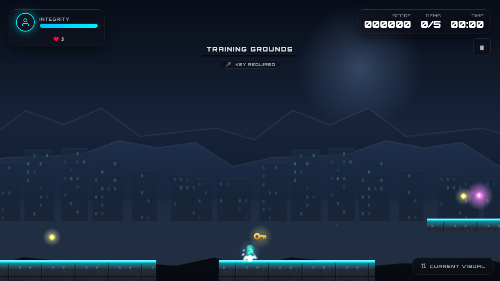
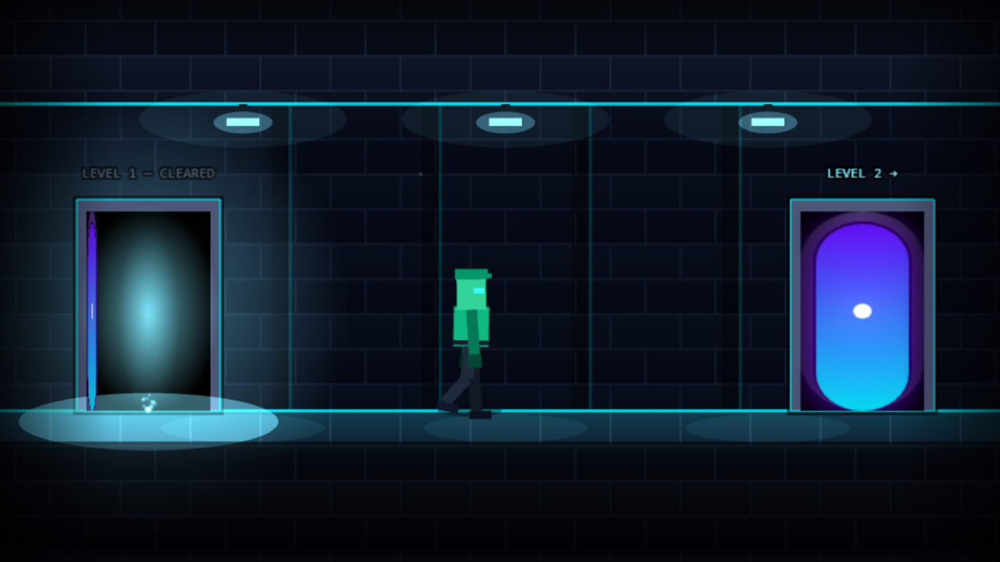
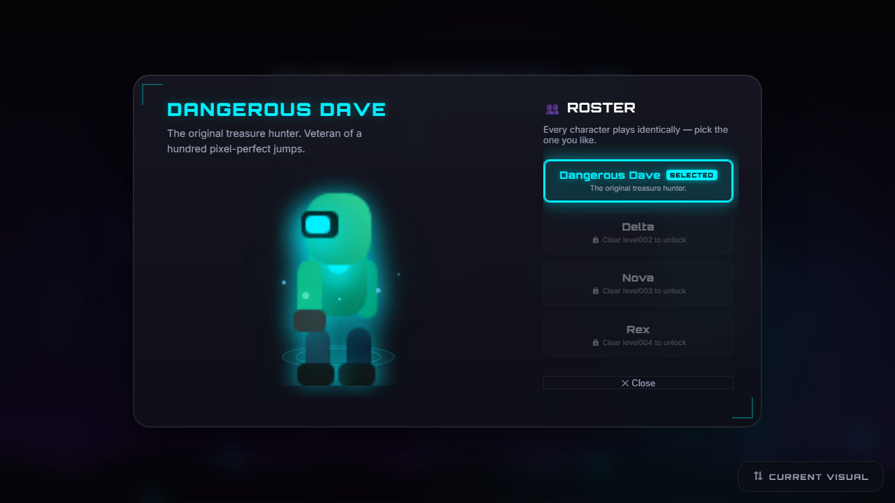
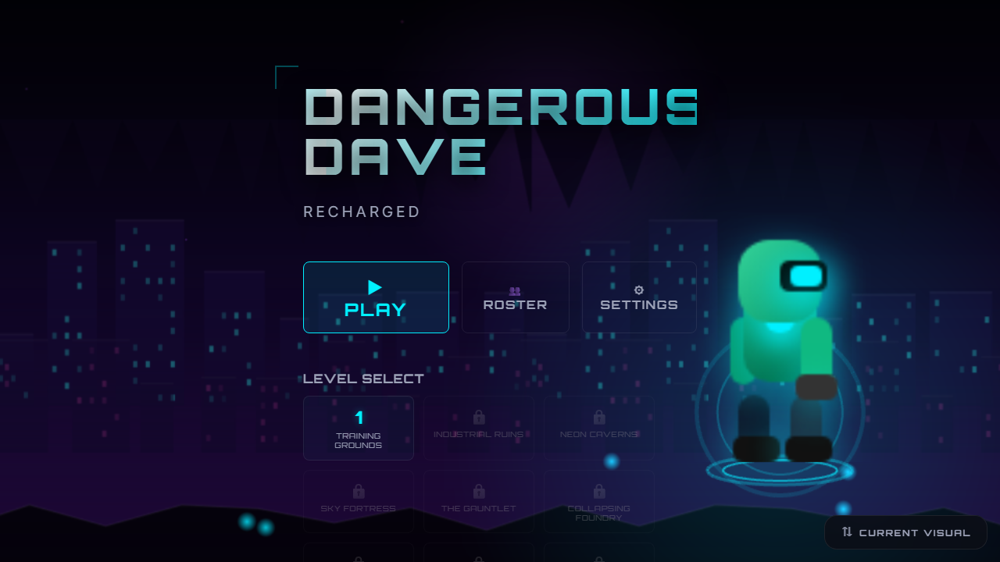
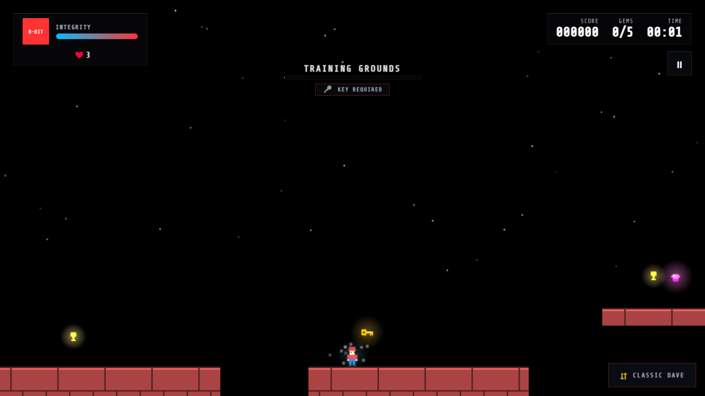

<div align="center">

# Dangerous Dave: Recharged

**A browser platformer about a locked door, a golden key, and three lives.**

[](https://siddharthachathra.github.io/dangerous-dave-recharged/)
[](https://github.com/SiddharthaChathra/dangerous-dave-recharged/actions/workflows/ci.yml)
[](https://www.typescriptlang.org/)
[](https://phaser.io/)

### ▶ **[siddharthachathra.github.io/dangerous-dave-recharged](https://siddharthachathra.github.io/dangerous-dave-recharged/)**

No install, no account, no backend. It runs in the tab you already have open.



</div>

---

## The idea

Ten hand-built levels. Every one of them holds a **key**, and the exit door stays locked until
you're holding it — so no level can be finished by sprinting to the right. Find the key, open
the door, walk the corridor to the next level.

You get **three lives for the whole run**. There are no checkpoints: a death costs one life and
puts you back at the start of the level you were on, never further back than that. Run out and
it's Game Over, and the campaign starts again from level 1.

Everything you see and hear is generated in code — every sprite, every sound. There is not a
single `.png` or `.mp3` in this repository.

---

## Screenshots

| The between-levels corridor | Character roster |
|---|---|
|  |  |
| Clear a level and you walk it — an articulated gait, not a sliding sprite. The doors are labelled with where you've been and where you're going. | Four characters, unlocked by clearing levels. They are cosmetic only: identical hitbox, speed and jump. |

| Main menu | Classic mode |
|---|---|
|  |  |
| The hero on the menu is whichever character you've picked, lit in their own colour. | Press **T** any time — mid-jump if you like — to repaint the entire game in its retro skin. |

---

## Two looks, one game

There's a switch in the corner marked **CURRENT VISUAL / CLASSIC DAVE**, and it works *during
play*. Toggling it swaps every texture in the world and leaves everything else exactly where it
was: your position, velocity, score, lives, timer, the enemies' patrol state, which gems you've
already collected.

That's the rule the code is built around — the two modes are a skin, never a different game.
Difficulty must not depend on which one you prefer.

---

## Controls

| Action | Keyboard | Touch |
|---|---|---|
| Move | `←` `→` or `A` `D` | On-screen D-pad |
| Jump | `↑`, `W` or `Space` | Jump button |
| Fire (once armed) | `F` or `Ctrl` | — |
| Switch visual mode | `T` | Toggle button |
| Pause | `Esc` | Pause button |

Jumping is deliberately forgiving: there's **coyote time** (a few frames of grace after you walk
off a ledge) and **jump buffering** (a jump pressed just before you land still fires).

---

## The campaign

| # | Level | Setting | Par |
|---|---|---|---|
| 1 | Training Grounds | Training | 75s |
| 2 | Industrial Ruins | Industrial | 90s |
| 3 | Neon Caverns | Neon | 110s |
| 4 | Sky Fortress | Sky | 120s |
| 5 | The Gauntlet | Fire & lava | 150s |
| 6 | Collapsing Foundry | Factory | 135s |
| 7 | The High Road | Neon | 150s |
| 8 | Sentry Shafts | Sky | 160s |
| 9 | Needlepoint | Neon | 175s |
| 10 | Dave's Last Stand | Fire & lava | 210s |

Levels introduce their mechanics in order: basic gaps, then moving and falling platforms, then
chase enemies and verticality, then fire and lava from level 3 onward.

**Every level is provably completable.** A test walks each one as a physics simulation — using
the real jump velocity, gravity and run speed — and fails the build if the key, the exit or any
collectible ever becomes unreachable. Difficulty comes from placement, never from geometry you
cannot cross.

---

## What's in it

- **10 levels**, each gated by a key the exit door won't open without
- **A between-levels corridor** with a procedurally animated walk cycle
- **4 playable characters**, unlocked by clearing levels — cosmetic only, by design
- **3 enemy types** — patrol, flying and chase — each with its own state machine
- **Hazards**: spikes, fire and lava, with damage boxes inset from the art so a graze doesn't kill
- **Moving and falling platforms**, and optional weapon pickups
- **Procedural art and Web Audio** — no image or sound files anywhere in the repo
- **Parallax backgrounds**, particle effects, camera follow with dead-zone, look-ahead and shake
- **Local save**: level unlocks, best scores and settings, in `localStorage`
- **Accessibility**: reduced-motion support, dark/light theming, full touch controls

---

## Running it locally

```bash
npm install
npm run dev          # http://localhost:5173/dangerous-dave-recharged/
```

```bash
npm run build        # production bundle into dist/
npm run preview      # serve that bundle
```

### Tests

```bash
npm run typecheck    # tsc --noEmit
npm run lint         # eslint
npm run test         # 269 unit tests (Vitest)
npm run e2e          # Playwright browser smoke test
```

All four run in CI on every push to `main`, and the site only deploys if they pass.

Some of the suite is unusual, and deliberately so. Beyond ordinary unit tests there are guards
for the kinds of bug that typechecking cannot catch: that every level stays completable, that
the corridor can always be skipped and always ends, that the frame-rate cap stays tied to the
physics constant it's meant to match, and that every object in the world is registered for
re-skinning when the visual mode changes.

---

## How it's built

| | |
|---|---|
| **Engine** | Phaser 3.90 (Arcade Physics) |
| **Language** | TypeScript, `strict` |
| **Build** | Vite 5 |
| **Tests** | Vitest + Playwright |
| **Hosting** | GitHub Pages, deployed by GitHub Actions |

The game canvas and the DOM UI are kept strictly apart and speak through one typed event bus.
Phaser owns the world; the HUD, menus and modals are plain DOM. Nothing reaches across — which
is what lets the interface be restyled without touching gameplay, and the gameplay be changed
without breaking the interface.

```
src/
  game/
    core/        event bus, config, constants, visual mode
    entities/    player, enemies, platforms, hazards, the key, the corridor walker
    levels/      the ten levels as data, plus the loader
    scenes/      boot, preload, menu, play, level transition
    systems/     audio, camera, input, particles, save, visual skinner
  ui/            HUD, menus, roster, overlays (DOM)
  utils/         physics, scoring, lives, level validation, corridor geometry
```

---

## About the name

This is an original game, written from scratch. It borrows the *shape* of a much-loved 1988
platformer — run, jump, collect, find the key, reach the door — as homage. It contains none of
that game's code, art, sound, levels or data, and is not affiliated with or endorsed by its
rights holders.
